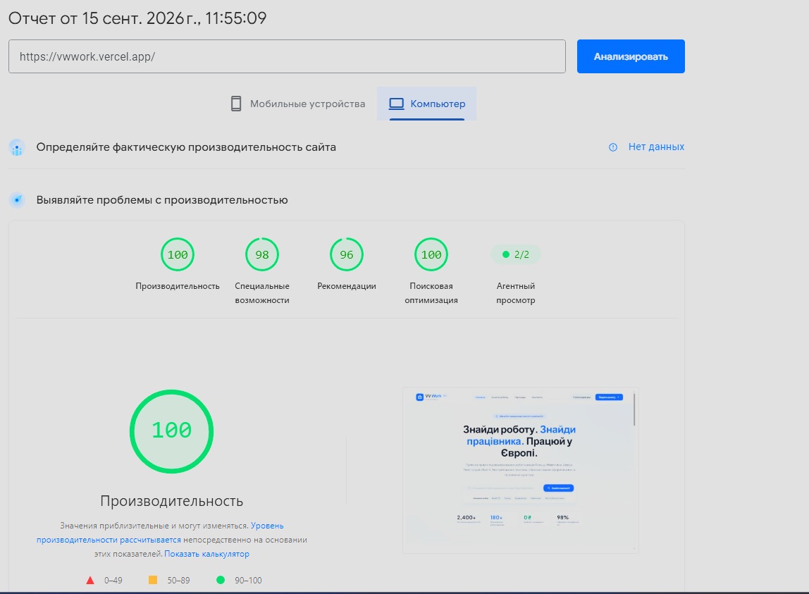
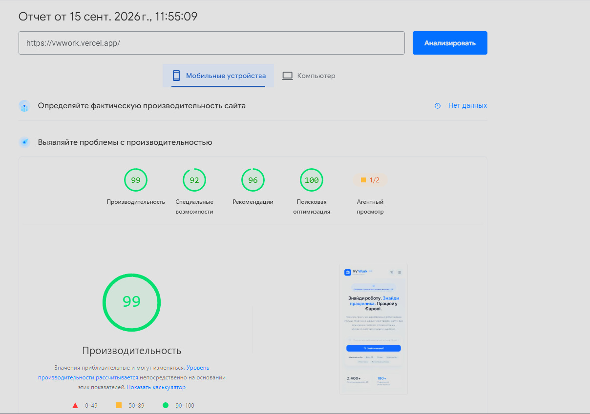

# VV Work — тестове завдання Frontend Developer

Платформа для пошуку роботи та працівників у Європі. Реалізовано три сторінки (Головна, Партнер, Контакти) зі спільними Header/Footer, мок-API з імітацією мережевих затримок і помилок, пошуком і фільтрацією вакансій, формами заявок з клієнтською валідацією.

🔗 **Деплой:** https://vwwork.vercel.app

---

## 🚀 Запуск проєкту

```bash
# Встановлення залежностей
npm install

# Локальний запуск (dev-сервер Vite)
npm run dev

# Продакшн-збірка
npm run build

# Перегляд продакшн-збірки локально
npm run preview

# Лінтинг
npm run lint

# Форматування коду (Prettier)
npm run format
```

Після `npm run dev` застосунок буде доступний за адресою, яку виведе Vite (типово `http://localhost:5173`).

---

## 🛠 Стек

- **React 19** + **TypeScript** (strict mode)
- **Vite** — збірка та dev-сервер
- **Tailwind CSS v4**
- **React Router v7** — маршрутизація, спільний Layout через `useOutletContext`
- **react-icons** — іконки
- **motion** — анімації
- **ESLint + Prettier** — лінтинг і форматування коду
- Без сторонніх UI-кітів, без Redux/Zustand — стейт-менеджмент на власних хуках і React Context

---

## 🏗 Архітектура проєкту

```
src/
├── pages/              # Сторінки-маршрути (Homepage, EmployeePage, ContactPage)
├── components/         # Перевикористовувані UI-компоненти, кожен у своїй папці
│   ├── Header/
│   ├── Footer/
│   ├── Hero/
│   ├── Categories/
│   ├── Partners/
│   ├── Vacancies/
│   ├── VacancyCard/
│   ├── VacancyFiltersBar/
│   ├── EmployeeProfileHeader/
│   ├── EmployerPromo/
│   ├── ErrorRetryBlock/
│   ├── SkeletonLoader/
│   ├── FaqAccordion/
│   ├── OfficeCard/
│   ├── ContactForm/
│   └── Modal/           # ModalWrapper, ApplicationModal, EmployerModal
├── hooks/
│   └── useDebounce.ts   # Ручна реалізація debounce без зовнішніх бібліотек
├── services/
│   └── api.ts            # Мок-API: моделі даних + simulateApiFetch-обгортка
├── types.ts               # Централізовані TypeScript-типи та інтерфейси пропсів
├── Layout.tsx             # Спільний Header/Footer, модалки, Outlet context
└── App.tsx                # Маршрутизація (React Router)
```

### Ключові архітектурні рішення

**Дані та мережа.** Усі запити йдуть через `simulateApiFetch` — обгортку, що імітує реальний бекенд: випадкова затримка 300–800мс і ~20% ймовірність помилки. Кожен асинхронний блок на сторінці (партнери, вакансії, профіль партнера) має власні незалежні стани `isLoading` / `error` / `isRetrying`, тому помилка завантаження одного блоку не блокує інші.

**Стейт-менеджмент без Redux/Zustand.** Локальний стан сторінок — через `useState`. Колбеки для відкриття модалок (заявка на вакансію, заявка роботодавця) передаються дочірнім сторінкам через `useOutletContext` від спільного `Layout`, без проп-дрилінгу через кілька рівнів компонентів.

**Оптимізація ре-рендерів.** Список вакансій фільтрується через `useMemo` (залежить від дебаунсженого пошукового запиту та обраної категорії, а не від кожного натискання клавіші). Картка вакансії (`VacancyCard`) обгорнута в `React.memo`; щоб мемоізація реально працювала, колбеки у `Layout` (`handleOpenApplicationModal` тощо) стабілізовані через `useCallback`, а сам об'єкт `outletContext` — через `useMemo`, щоб уникнути каскадного пересворення пропсів при кожному рендері `Layout`.

**Пошук і фільтрація.** Ручний debounce (350мс на сторінці партнера, 300мс на Головній) реалізований власним хуком `useDebounce` без зовнішніх бібліотек. Пошук за назвою, описом, містом і країною комбінується з фільтром за категорією одночасно.

---

## 📊 Lighthouse

> 
> 

---

## ✅ Якість коду та тестування

Проєкт покривається кількома шарами перевірки якості коду:

- **TypeScript strict mode** — типізація без `any` на всьому кодовій базі,
  централізовані типи та інтерфейси пропсів у `types.ts`.
- **ESLint** (`typescript-eslint`, `eslint-plugin-react-hooks`) — статичний
  аналіз коду, включно з перевіркою коректності залежностей хуків.
- **Prettier** — єдине форматування коду по всьому проєкту.
- **CI (GitHub Actions)** — автоматичний прогін лінтера та збірки при
  кожному push/pull request у `main` (`.github/workflows/`), щоб код,
  який не проходить перевірки, не потрапляв у гілку.

**Unit-тести (Jest/Vitest) на поточний момент не реалізовані.** Це
усвідомлена прогалина: тестування — інструмент, з яким я ще не мав
практичного досвіду, і за відведений термін вирішив пріоритизувати
коректну реалізацію функціональності, обробку помилок/завантаження та
адаптивність, а не поверхневе покриття тестами заради формальної цифри.

Найближчим часом планую закрити цю прогалину. Якби писав тести зараз,
у першу чергу покрив би:

- **`useDebounce`** — через `@testing-library/react` (`renderHook`) і
  `vi.useFakeTimers()`: перевірка, що значення не оновлюється до
  завершення затримки, скидання таймера при швидких послідовних змінах.
- **Валідацію форми заявки** — виніс би `validate()` з компонента в чисту
  функцію-утиліту (`utils/validation.ts`), щоб тестувати набори вхідних
  даних без рендеру всієї форми.
- **Retry-логіку** — перевірка, що натискання кнопки в `ErrorRetryBlock`
  викликає переданий `onRetry`-колбек.

---

## 💡 Мої рішення

1. **Структура Головної сторінки** — блоки йдуть у порядку зростання "залученості" користувача: Hero (миттєве пояснення цінності) → Категорії (швидкий вхід у пошук) → Партнери (довіра до платформи через конкретних роботодавців) → блок для роботодавців (охоплення другої аудиторії) → Вакансії (основний контент) → "Як це працює" (закриття заперечень перед конверсією).

2. **Пошук та фільтрація без зайвих ре-рендерів.** Комбінація ручного debounce (350мс) і `useMemo` для похідного списку вакансій дозволяє уникнути перерахунку фільтрації на кожне натискання клавіші. Додатково `React.memo` на картці вакансії у поєднанні зі стабілізованими через `useCallback`/`useMemo` колбеками з `Layout` запобігає ре-рендеру карток, чиї дані фактично не змінились.

3. **Стейт-менеджмент без Redux/Zustand.** Для проєкту такого масштабу (3 сторінки, невелика кількість спільного стану — переважно стан модалок) повноцінний state-менеджер створив би зайву складність. `useOutletContext` React Router покриває потребу прокинути колбеки відкриття модалок у дочірні сторінки без проп-дрилінгу.

4. **Мок-API як окремий шар.** `simulateApiFetch` імітує реальні мережеві умови (затримка, випадкова помилка) для будь-якого запиту — це змушує послідовно обробляти `loading`/`error`/`success` стани на кожній сторінці з асинхронними даними, а не лише в "щасливому" сценарії.

### Відступи від брифу

1. **Маршрут `/contacts` замість `/контакти`.** URL з кирилицею вимагає
   percent-encoding, гірше копіюється й шариться — латинський слаг є
   стандартною практикою незалежно від мови контенту.

2. **Два сценарії подачі заявки.** Окрім заявки на конкретну вакансію,
   додано "швидку заявку" без прив'язки до вакансії (доступна з Header) —
   користувач може лишити анкету, навіть не обравши конкретну пропозицію.

3. **Розширена форма для роботодавців.** Замість простого перенаправлення
   на сторінку контактів — окрема форма з релевантними для B2B-аудиторії
   полями (компанія, кількість працівників, країна).

---
